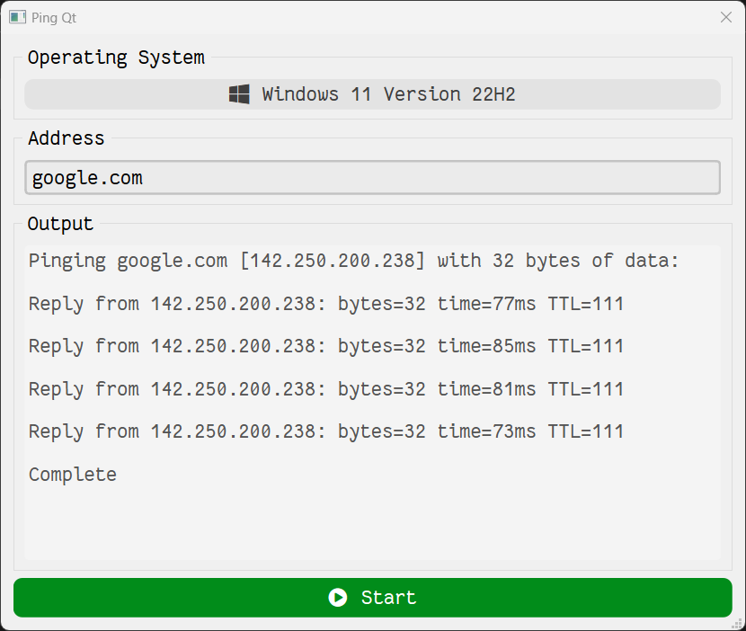

# Ping

GUI for ping utility using Qt.

## Screenshot



## Development

### Tools required

- CMake 3.5+
- Qt 6.0.4+
- C++17 capable compiler:
  - Visual C++ 15.9 (Visual Studio 2017)
  - Clang 5
  - GCC 7

### Set up

Build with CMake

```bash
cmake . -B build
cmake --build build
```

## Release

```bash
cmake . -B build
cmake --build build --config Release --target ALL_BUILD -j 10
```

## License

Licensed under the [MIT](LICENSE) License.
